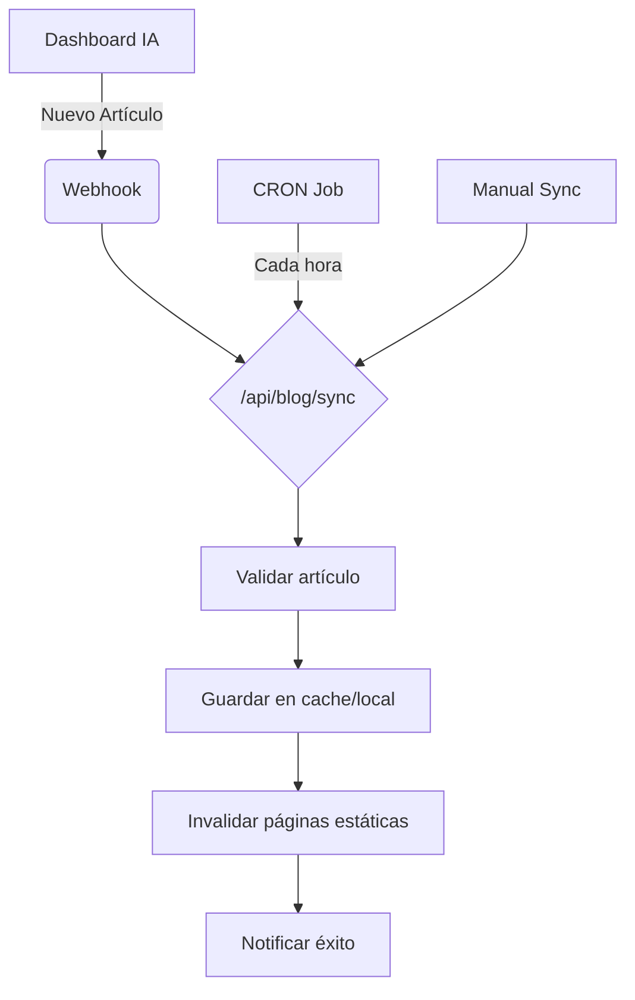

# Arquitectura para Blog con IA - Ai-Studio Marketing

## Resumen Ejecutivo

Diseño completo para integrar un Blog con IA que consume artículos automáticamente desde un dashboard externo mediante API REST.

## Arquitectura Propuesta

### 1. Estructura de Datos

#### Modelo de Artículo (Article)

```typescript
interface Article {
  id: string;
  title: string;
  slug: string;
  excerpt: string;
  content: string; // Markdown o HTML
  author: {
    name: string;
    avatar?: string;
    bio?: string;
  };
  category: {
    id: string;
    name: string;
    slug: string;
  };
  tags: string[];
  featuredImage?: {
    url: string;
    alt: string;
    caption?: string;
  };
  seo: {
    metaTitle?: string;
    metaDescription?: string;
    keywords?: string[];
    canonicalUrl?: string;
  };
  publishedAt: string;
  updatedAt: string;
  status: 'draft' | 'published' | 'archived';
  readingTime: number; // minutos
  views: number;
  aiGenerated: boolean;
  aiPrompt?: string; // prompt usado para generar el artículo
}
```

#### Modelo de Categoría (Category)

```typescript
interface Category {
  id: string;
  name: string;
  slug: string;
  description?: string;
  color?: string;
  icon?: string;
  parentId?: string; // para categorías anidadas
}
```

### 2. Estructura de API REST

#### Endpoints para el Dashboard IA

```typescript
// API Base: https://api.ai-studiomarketing.com/v1

// GET /articles
// Obtiene listado de artículos con paginación y filtros
interface GetArticlesResponse {
  data: Article[];
  pagination: {
    page: number;
    limit: number;
    total: number;
    totalPages: number;
  };
  filters: {
    category?: string;
    tags?: string[];
    status?: string;
    search?: string;
  };
}

// GET /articles/:id
// Obtiene un artículo específico
interface GetArticleResponse {
  data: Article;
}

// POST /articles
// Crea un nuevo artículo (generado por IA)
interface CreateArticleRequest {
  title: string;
  prompt: string;
  category: string;
  tags: string[];
  targetLength?: number; // palabras
  tone?: 'professional' | 'casual' | 'technical' | 'promotional';
}

// PUT /articles/:id
// Actualiza un artículo existente
interface UpdateArticleRequest {
  title?: string;
  content?: string;
  excerpt?: string;
  category?: string;
  tags?: string[];
  status?: 'draft' | 'published' | 'archived';
}

// DELETE /articles/:id
// Elimina un artículo

// GET /categories
// Obtiene todas las categorías
interface GetCategoriesResponse {
  data: Category[];
}

// POST /categories
// Crea una nueva categoría

// GET /articles/sync
// Sincroniza artículos con el blog
interface SyncArticlesResponse {
  synced: number;
  updated: number;
  created: number;
  errors: string[];
}
```

### 3. Arquitectura del Blog en Next.js

#### Estructura de Archivos

```
app/
├── blog/
│   ├── page.tsx                    # Listado de artículos
│   ├── [slug]/
│   │   └── page.tsx               # Detalle de artículo
│   ├── category/
│   │   └── [slug]/
│   │       └── page.tsx          # Artículos por categoría
│   ├── tag/
│   │   └── [slug]/
│   │       └── page.tsx          # Artículos por etiqueta
│   └── layout.tsx                # Layout específico del blog
├── api/
│   └── blog/
│       ├── articles/
│       │   ├── route.ts          # GET /api/blog/articles
│       │   └── [slug]/
│       │       └── route.ts      # GET /api/blog/articles/[slug]
│       ├── sync/
│       │   └── route.ts          # POST /api/blog/sync
│       └── categories/
│           └── route.ts          # GET /api/blog/categories
lib/
├── blog/
│   ├── types.ts                   # Tipos de datos
│   ├── api.ts                     # Cliente API
│   ├── utils.ts                   # Utilidades
│   └── constants.ts               # Constantes
components/
├── blog/
│   ├── article-card.tsx           # Tarjeta de artículo
│   ├── article-list.tsx           # Listado de artículos
│   ├── article-detail.tsx         # Detalle de artículo
│   ├── category-filter.tsx        # Filtro por categorías
│   ├── tag-cloud.tsx              # Nube de etiquetas
│   ├── search-bar.tsx             # Barra de búsqueda
│   └── pagination.tsx             # Paginación
hooks/
├── blog/
│   ├── use-articles.ts            # Hook para obtener artículos
│   ├── use-categories.ts          # Hook para obtener categorías
│   └── use-search.ts              # Hook para búsqueda
```

### 4. Estrategia de Sincronización

#### Opción A: Sincronización Automática (Recomendada)

- **Webhook**: El dashboard notifica cuando hay nuevos artículos
- **CRON Job**: Sincronización cada hora como fallback
- **ISR**: Incremental Static Regeneration para rendimiento

#### Opción B: Sincronización Manual

- **Botón de sincronización** en panel de administración
- **API endpoint** para sincronización bajo demanda

#### Flujo de Sincronización



### 5. Optimización SEO

#### Meta Tags Dinámicos

- **Títulos**: `{title} | Ai-Studio Marketing Blog`
- **Descripciones**: Auto-generadas del excerpt
- **Open Graph**: Imágenes y descripciones específicas
- **JSON-LD**: Schema.org para artículos

#### URLs Amigables

- `/blog` - Listado principal
- `/blog/{slug}` - Detalle de artículo
- `/blog/category/{slug}` - Por categoría
- `/blog/tag/{slug}` - Por etiqueta

#### Sitemap Automático

- Generación dinámica de sitemap.xml
- Incluye todos los artículos y categorías

### 6. Cache y Rendimiento

#### Estrategia de Cache

```typescript
// Next.js Data Cache
const articles = await fetch('https://api.ai-studiomarketing.com/v1/articles', {
  next: { 
    revalidate: 3600, // 1 hora
    tags: ['blog-articles'] 
  }
});

// ISR para páginas de artículos
export const revalidate = 3600;
```

#### Cliente API con Cache

```typescript
// lib/blog/api.ts
class BlogAPI {
  private cache = new Map();
  private baseURL = 'https://api.ai-studiomarketing.com/v1';
  
  async getArticles(params?: GetArticlesParams) {
    const cacheKey = `articles-${JSON.stringify(params)}`;
    if (this.cache.has(cacheKey)) {
      return this.cache.get(cacheKey);
    }
    
    const response = await fetch(`${this.baseURL}/articles?${new URLSearchParams(params)}`);
    const data = await response.json();
    
    this.cache.set(cacheKey, data);
    setTimeout(() => this.cache.delete(cacheKey), 3600000); // 1 hora
    
    return data;
  }
}
```

### 7. Componentes React Principales

#### ArticleCard Component

```typescript
interface ArticleCardProps {
  article: Article;
  variant?: 'default' | 'featured' | 'compact';
}

export function ArticleCard({ article, variant = 'default' }: ArticleCardProps) {
  return (
    <article className="blog-card">
      <Image src={article.featuredImage?.url} alt={article.featuredImage?.alt} />
      <div className="content">
        <CategoryBadge category={article.category} />
        <h2>{article.title}</h2>
        <p>{article.excerpt}</p>
        <div className="meta">
          <span>{article.readingTime} min read</span>
          <span>{formatDate(article.publishedAt)}</span>
        </div>
      </div>
    </article>
  );
}
```

### 8. Implementación Gradual

#### Fase 1: Estructura Básica (1-2 semanas)

- [ ] Crear tipos de datos
- [ ] Implementar layout del blog
- [ ] Crear componentes básicos
- [ ] Configurar rutas

#### Fase 2: Integración API (1 semana)

- [ ] Implementar cliente API
- [ ] Crear endpoints internos
- [ ] Configurar sincronización
- [ ] Probar flujo completo

#### Fase 3: SEO y Optimización (1 semana)

- [ ] Implementar meta tags dinámicos
- [ ] Configurar sitemap
- [ ] Optimizar rendimiento
- [ ] Implementar cache

#### Fase 4: Funcionalidades Avanzadas (1-2 semanas)

- [ ] Búsqueda y filtrado
- [ ] Categorías y etiquetas
- [ ] Panel de administración
- [ ] Análisis y métricas

## Consideraciones Técnicas

### Seguridad

- **API Keys**: Variables de entorno para claves de API
- **Rate Limiting**: Límite de peticiones a API externa
- **Validación**: Sanitización de contenido de IA

### Escalabilidad

- **CDN**: Para imágenes y assets estáticos
- **Database**: Considerar PostgreSQL para datos persistentes
- **Monitoring**: Logs y métricas de sincronización

### Mantenimiento

- **Error Handling**: Robusta gestión de errores de API
- **Fallbacks**: Contenido estático si API falla
- **Logs**: Registro de sincronizaciones y errores

## Próximos Pasos

1. **Validar arquitectura** con equipo técnico
2. **Definir endpoints específicos** del dashboard IA
3. **Configurar entorno de desarrollo**
4. **Implementar Fase 1** (estructura básica)
5. **Testing y validación** del flujo completo

## Recursos Adicionales

- [Next.js Documentation](https://nextjs.org/docs)
- [Schema.org for Articles](https://schema.org/Article)
- [Open Graph Protocol](https://ogp.me/)
- [SEO Best Practices for Blogs](https://developers.google.com/search/blog)
